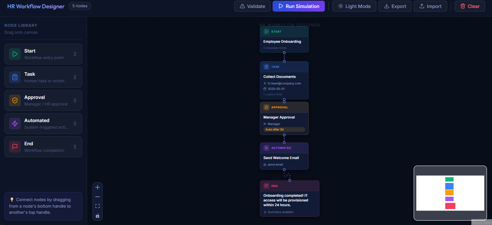

# HR Workflow Designer

A visual, drag-and-drop HR workflow prototyping tool built for the Tredence Analytics Full-Stack Engineering Internship case study.



---

## 🚀 Getting Started

```bash
npm install
npm run dev
```

Then open [http://localhost:5173](http://localhost:5173).

> **Note**: Mock Service Worker (MSW) is automatically initialized in the browser. You may see a console message from MSW on first load — this is expected.

---

## 🏗️ Architecture

```
src/
├── api/                  # Mock API layer (MSW)
│   ├── handlers.ts       # GET /automations, POST /simulate
│   └── browser.ts        # MSW worker setup
├── components/
│   ├── canvas/           # React Flow canvas, sidebar, toolbar
│   │   ├── WorkflowCanvas.tsx
│   │   ├── NodeSidebar.tsx
│   │   └── CanvasToolbar.tsx
│   ├── nodes/            # Custom node renderers (one per type)
│   │   ├── StartNode.tsx
│   │   ├── TaskNode.tsx
│   │   ├── ApprovalNode.tsx
│   │   ├── AutomatedNode.tsx
│   │   ├── EndNode.tsx
│   │   └── index.ts      # nodeTypes registry
│   ├── forms/            # Node config panels
│   │   ├── NodeFormPanel.tsx   # Dispatcher
│   │   ├── StartForm.tsx
│   │   ├── TaskForm.tsx
│   │   ├── ApprovalForm.tsx
│   │   ├── AutomatedForm.tsx
│   │   └── EndForm.tsx
│   ├── sandbox/          # Simulation modal
│   │   └── SandboxPanel.tsx
│   └── ui/               # Shared primitives
│       └── KeyValueEditor.tsx
├── hooks/
│   ├── useAutomations.ts # Fetches mock automation actions
│   └── useSimulate.ts    # POSTs workflow for simulation
├── store/
│   └── workflowStore.ts  # Zustand store (nodes, edges, selection, errors)
├── types/
│   └── workflow.ts       # All TypeScript interfaces
├── utils/
│   ├── graphValidator.ts # Pure graph validation (no React deps)
│   └── serializer.ts     # Workflow → JSON + download
├── App.tsx
└── main.tsx
```

---

## 🔧 Tech Stack

| Concern       | Technology              | Why                                              |
|---------------|-------------------------|--------------------------------------------------|
| Framework     | React 18 + TypeScript   | Type safety, scalability                         |
| Bundler       | Vite                    | Fast HMR, modern ESM                            |
| Canvas        | React Flow (@xyflow/react) | Mature, feature-rich flow library             |
| State         | Zustand                 | Minimal boilerplate, perfect for canvas state   |
| Forms         | React Hook Form + Zod   | Controlled forms, schema validation, extensible |
| Mock API      | MSW (Mock Service Worker) | In-browser API mocking, no backend needed     |
| Icons         | Lucide React            | Consistent, lightweight icons                   |
| Styling       | Vanilla CSS             | Full control, no framework overhead             |

---

## 🧩 Node Types

| Node       | Color    | Purpose                              |
|------------|----------|--------------------------------------|
| Start      | 🟢 Green  | Workflow entry point, title + metadata |
| Task       | 🔵 Blue   | Human task: title, assignee, due date, custom fields |
| Approval   | 🟡 Amber  | Approval step: role, auto-approve threshold |
| Automated  | 🟣 Purple | System action: select from mock API, fill dynamic params |
| End        | 🔴 Red    | Workflow end: message, summary toggle |

---

## 🖱️ How to Use

1. **Add Nodes** – Drag any node type from the left sidebar onto the canvas
2. **Connect Nodes** – Drag from a node's bottom handle to another's top handle
3. **Configure Nodes** – Click any node → form panel slides in from the right
4. **Validate** – Click `Validate` in the toolbar to check for structural issues
5. **Simulate** – Click `Run Simulation` → sandbox modal shows step-by-step execution log
6. **Export** – Download your workflow as a JSON file
7. **Import** – Load a previously exported workflow JSON
8. **Delete** – Select nodes/edges and press `Delete`

---

## 🌐 Mock API

Implemented with MSW (Mock Service Worker):

### `GET /api/automations`
Returns a list of available automation actions:
```json
[
  { "id": "send_email", "label": "Send Email", "params": ["to", "subject", "body"] },
  { "id": "generate_doc", "label": "Generate Document", "params": ["template", "recipient"] },
  { "id": "notify_slack", "label": "Notify Slack", "params": ["channel", "message"] },
  ...
]
```

### `POST /api/simulate`
Accepts a serialized workflow graph. Performs a topological traversal starting from the Start node and returns a step-by-step execution log:
```json
{
  "success": true,
  "steps": [
    { "nodeId": "start-1", "nodeType": "start", "label": "Start", "status": "success", "message": "Workflow initiated", "timestamp": 1234567890 }
  ],
  "errors": []
}
```

---

## 🔍 Validation Rules

The `graphValidator.ts` utility (pure function, no React deps) checks:

- ✅ Exactly one **Start** node exists
- ✅ At least one **End** node exists  
- ⚠️ No **orphan nodes** (disconnected from all edges)
- ❌ No **cycles** detected via DFS

---

## ✅ Completed Features

- [x] Drag-and-drop workflow canvas (React Flow)
- [x] 5 custom node types with distinct visual styles
- [x] 5 fully-controlled node configuration forms (React Hook Form)
- [x] Dynamic form fields (AutomatedForm fetches actions and renders params)
- [x] Key-value pair editor for metadata and custom fields
- [x] Toggle component for boolean fields
- [x] Zustand store (nodes, edges, selected node, validation errors)
- [x] Mock API with MSW (`/api/automations`, `/api/simulate`)
- [x] Graph traversal simulation with step-by-step execution log
- [x] Animated execution timeline in Sandbox panel
- [x] Structural graph validation with error reporting
- [x] Export workflow as JSON
- [x] Import workflow from JSON file
- [x] Minimap + Zoom controls
- [x] Dark glassmorphism design system

## ⏳ Not Implemented (with more time)

- Undo/Redo (would use `useHistoryState` or a command pattern)
- Auto-layout (Dagre or ELK.js integration)
- Node templates (pre-built workflow recipes)
- Node version history
- Visual validation error badges on nodes
- Persistent storage (localStorage or backend API)

---

## 🎨 Design Decisions

1. **Zustand over Context**: The canvas state is high-frequency (every node drag mutates state). Zustand's fine-grained subscriptions avoid full re-renders.

2. **React Hook Form `watch()` pattern**: Each node form watches its own fields and calls `updateNodeData` on change. This decouples the form from React Flow — forms don't need to know about React Flow at all.

3. **MSW over JSON Server**: MSW runs entirely in the browser with no separate process. The simulation logic is in `handlers.ts` and performs actual graph traversal — it's not just fake data.

4. **Pure `graphValidator.ts`**: Zero React dependencies. This makes it trivial to test independently and reuse server-side if needed.

5. **Extensibility**: Adding a new node type requires:
   - A new entry in `types/workflow.ts`
   - A new renderer in `components/nodes/`
   - A new form in `components/forms/`
   - Registering in `nodes/index.ts` and `NodeFormPanel.tsx`

---

## Author

Built for the Tredence Analytics – Full Stack Engineering Internship Case Study, April 2025.
